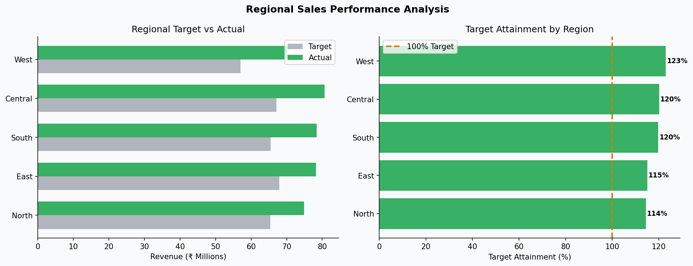

# 🗺️ Regional Sales Performance Analysis

**Domain:** Sales Reporting &nbsp;|&nbsp; **Stack:** Python · Pandas · SQL · Matplotlib


---

## 🎯 Business Problem

Regional sales leadership needed visibility into which territories were hitting targets, where discount dependency was eroding margin, and which reps drove the most revenue variance.

---

## 📊 Dashboard Preview



---

## 📈 Key Insights

- North region consistently below target — discount rate 4pp above national average
- Top 2 products account for 60%+ of regional revenue
- High-discount SKUs show lower net margin despite volume gains

## 💡 Recommendations

- Review discount approval thresholds in underperforming regions
- Shift focus to high-margin product mix in North territory
- Implement monthly attainment tracking at rep level

---

## 📁 Structure

```
01_Regional_Sales_Analysis/
├── data/sales_data.csv        # 2,000 transactions
├── sql/queries.sql            # 10 queries: ranking, window, target attainment
├── analysis/analysis.py       # Python KPI analysis
├── visuals/                   # Regional performance chart
└── report/
    ├── regional_summary.csv
    └── monthly_trend.csv
```

## 🚀 Run

```bash
pip install -r ../../requirements.txt
python analysis/analysis.py
```

---

*Dataset generated for educational and portfolio purposes.*
