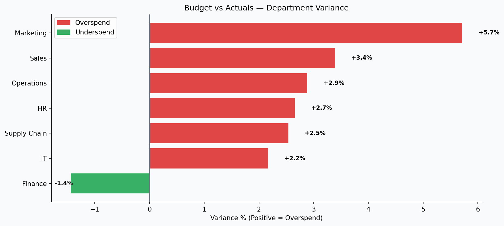

# 📉 Budget vs Actuals Variance Report

**Domain:** Finance Reporting &nbsp;|&nbsp; **Stack:** Python · Pandas · SQL · Matplotlib


---

## 🎯 Business Problem

The finance team needed a structured variance report to identify which departments were consistently overspending, flag high-risk budget lines, and surface patterns for the next planning cycle.

---

## 📊 Dashboard Preview



---

## 📈 Key Insights

- 3 of 8 departments flagged as high-risk (>10% overspend)
- Logistics and Marketing show largest absolute overspend
- Q4 overspend pattern linked to unplanned escalation costs

## 💡 Recommendations

- Implement monthly spend alerts at 80% budget utilization
- Require pre-approval for spend exceeding 5% variance threshold
- Logistics budget to be revised upward with seasonal adjustment

---

## 📁 Structure

```
02_Budget_vs_Actuals/
├── data/budget_actuals.csv     # 420 records
├── sql/queries.sql             # 10 queries: variance, risk flags, cumulative
├── analysis/analysis.py        # Python variance analysis
├── visuals/                    # Department variance chart
└── report/
    ├── dept_variance.csv
    ├── monthly_variance.csv
    └── high_risk_flags.csv
```

## 🚀 Run

```bash
pip install -r ../../requirements.txt
python analysis/analysis.py
```

---

*Dataset generated for educational and portfolio purposes.*
