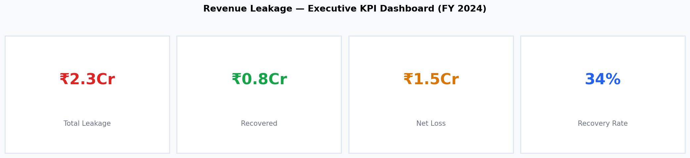
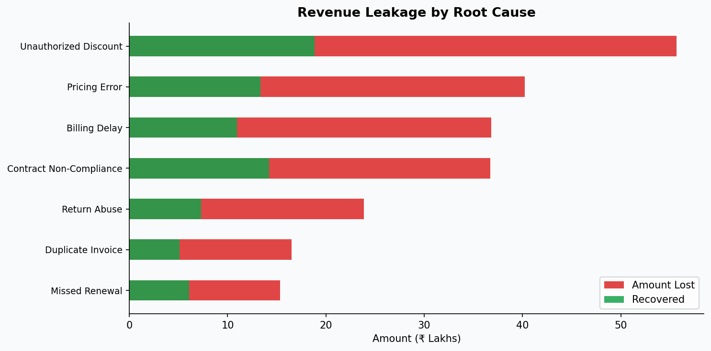
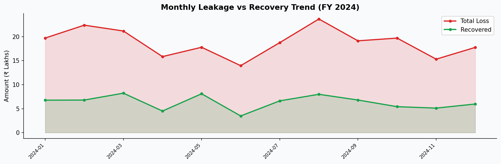

# 🔍 Revenue Leakage & Root Cause Analysis

**Domain:** Finance & Sales Reporting &nbsp;|&nbsp; **Stack:** Python · Pandas · SQL · Matplotlib


---

## 🎯 Business Problem

The revenue assurance team needed to quantify leakage across 7 categories, assess recovery effectiveness by detection method, and prioritise which leakage types to address first to maximise financial recovery.

---

## 📊 Dashboard Preview

**KPI Summary**



**Root Cause Breakdown**



**Monthly Trend**



---

## 📈 Key Insights

- **Total Leakage:** ~₹2.2Cr identified in FY2024
- **Recovery Rate:** 41% — largest gap in "Duplicate Invoice" category
- **Top Root Cause:** Unauthorized Discounts (25% of all incidents)
- **Best Detection:** Audit team recovers 2× more than System Flags

## 💡 Recommendations

- Prioritise "Duplicate Invoice" category — lowest recovery rate, highest addressable gap
- Automate System Flag escalations to match Audit team recovery efficiency
- Implement ₹50K+ incident alerts for immediate response
- Quarterly leakage review cadence with department heads

---

## 📁 Project Structure

```
03_Revenue_Leakage_Analysis/
├── data/leakage_data.csv          # 1,500 transactions across FY2024
├── sql/queries.sql                # 10 queries: CTEs, window functions, running SUM
├── analysis/analysis.py           # Root cause + recovery analysis (Pandas)
├── visuals/                       # KPI dashboard, type breakdown, monthly trend
└── report/
    ├── leakage_by_type.csv
    ├── leakage_by_region.csv
    └── monthly_leakage.csv
```

---

## 🔍 Analyses Performed

| Analysis | Method |
|---|---|
| Executive Summary (Loss / Recovery / Net) | Aggregation |
| Root Cause Breakdown by Leakage Type | GroupBy + share % |
| Regional Leakage Hotspot | Ranked regional view |
| Detection Method ROI | Recovery efficiency by source |
| Written Off vs Recoverable Split | Status-based filtering |
| Top 20 Largest Incidents | Ranked transaction view |
| Monthly Leakage Trend | Time-series aggregation |
| Cumulative Loss Tracking | SQL running SUM() OVER |

---

## 🚀 Run

```bash
pip install -r ../../requirements.txt
python analysis/analysis.py
```

---

## ⚠️ Limitations & Assumptions

- Production deployment would require ERP/CRM integration (SAP, Salesforce)
- Recovery timelines not modeled — instant recovery assumed at detection date
- Detection method classification is static, not predictive
- Recovery rates applied uniformly; real-world rates vary by leakage type and incident age

## 🔄 If This Were Production

- Live ingestion via ERP API with daily refresh
- Automated escalation alerts at configurable thresholds (e.g. ₹50K+ per incident)
- 30/60/90-day recovery probability scoring per leakage category
- Executive summary auto-emailed weekly

---

*Dataset generated for educational and portfolio purposes.*
