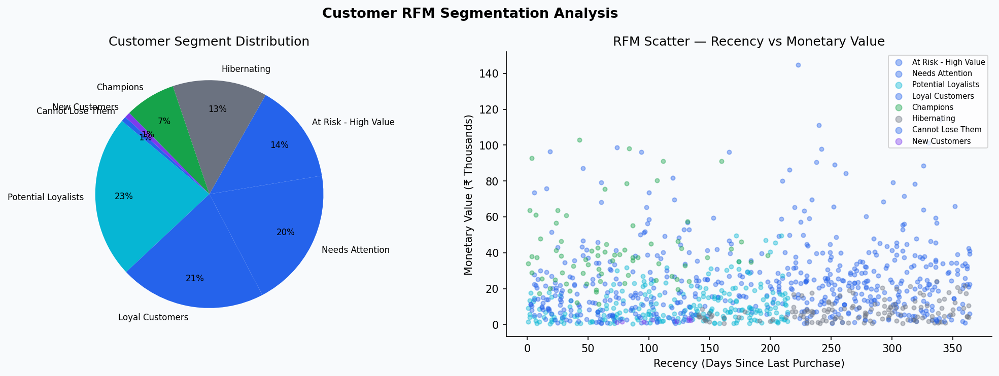

# 👥 Customer RFM Segmentation

**Domain:** Customer Analytics &nbsp;|&nbsp; **Stack:** Python · Pandas · SQL · Matplotlib


---

## 🎯 Business Problem

The CRM team needed a data-driven customer segmentation to prioritise retention spend, identify churn-risk accounts, and guide personalised outreach by segment.

---

## 📊 Dashboard Preview



---

## 📈 Key Insights

- Champions (top RFM) represent ~15% of customers but drive disproportionate revenue
- At-Risk segment: 200+ customers with high historical spend but increasing recency gap
- New Customers with high monetary value flagged for early loyalty programme onboarding

## 💡 Recommendations

- Champions: exclusive retention programme — prevent churn at all cost
- At-Risk: reactivation campaign within 30 days
- Hibernating: low-cost email reactivation to test responsiveness before write-off

---

## 📁 Structure

```
04_RFM_Segmentation/
├── data/customer_data.csv         # 1,000 customers
├── sql/queries.sql                # 10 queries: NTILE scoring, segment ranking
├── analysis/analysis.py           # RFM scoring + segmentation (Pandas)
├── visuals/                       # Segment distribution + scatter
└── report/
    ├── segment_summary.csv
    ├── rfm_scored_customers.csv
    └── at_risk_customers.csv
```

## 🚀 Run

```bash
pip install -r ../../requirements.txt
python analysis/analysis.py
```

---

*Dataset generated for educational and portfolio purposes.*
