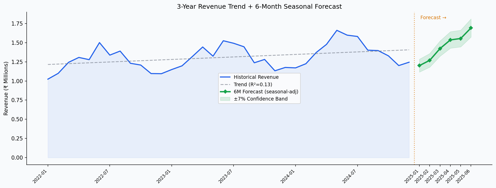
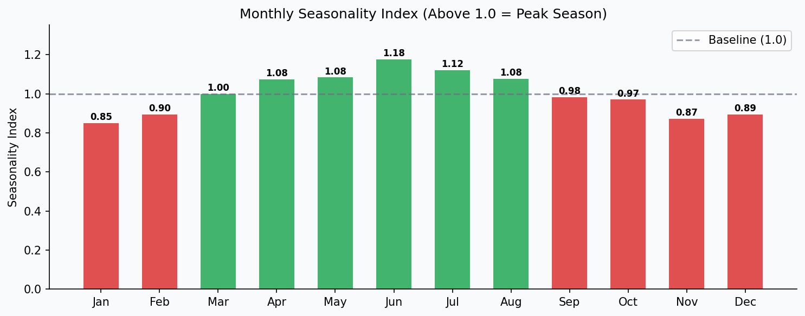

# 📈 Sales Forecasting & Trend Analysis

**Domain:** Planning & Forecasting &nbsp;|&nbsp; **Stack:** Python · Pandas · NumPy · SQL · Matplotlib


---

## 🎯 Business Problem

The sales planning team needed a data-driven method to understand 3-year revenue trends, quantify seasonal patterns, and generate a 6-month forward forecast with confidence bounds — supporting annual planning and quarterly business reviews.

---

## 📊 Dashboard Preview

**Revenue Trend + 6-Month Forecast**



**Monthly Seasonality Index**



---

## 📈 Key Insights

- **3-Year CAGR:** ~18% revenue growth trend
- **Peak Season:** September–October (Seasonality Index: 1.12)
- **Trough:** February (Seasonality Index: 0.87)
- **6-Month Forecast:** ₹9.4Cr (seasonal-adjusted), slope ₹6,200/month

## 💡 Recommendations

- Increase inventory and staffing pre-September to capture peak demand
- Run promotions in February to offset seasonal trough
- Use forecast as baseline input to annual budget process

---

## 📁 Structure

```
05_Sales_Forecasting/
├── data/monthly_revenue.csv       # 36 months (2022–2024)
├── sql/queries.sql                # 10 queries: YoY, seasonality, moving avg
├── analysis/analysis.py           # Trend + seasonal forecast (Python)
├── visuals/                       # Forecast chart + seasonality index
└── report/
    ├── 6month_forecast.csv
    └── trend_analysis.csv
```

## 🚀 Run

```bash
pip install -r ../../requirements.txt
python analysis/analysis.py
```

---

## ⚠️ Limitations & Assumptions

- Linear regression with seasonal adjustment — suitable for planning discussions, not production deployment
- Confidence intervals (±7%) are heuristic bounds, not statistically derived prediction intervals
- 36-month dataset is sufficient for trend detection but limited for robust seasonality modeling
- For production forecasting, SARIMA or Facebook Prophet would be more appropriate

## 🔄 If This Were Production

- `statsmodels` SARIMAX or `prophet` for statistically sound intervals
- External variables: promotions calendar, macroeconomic indicators
- Forecast accuracy tracking (MAPE, RMSE) against actuals month-over-month

---

*Dataset generated for educational and portfolio purposes.*
